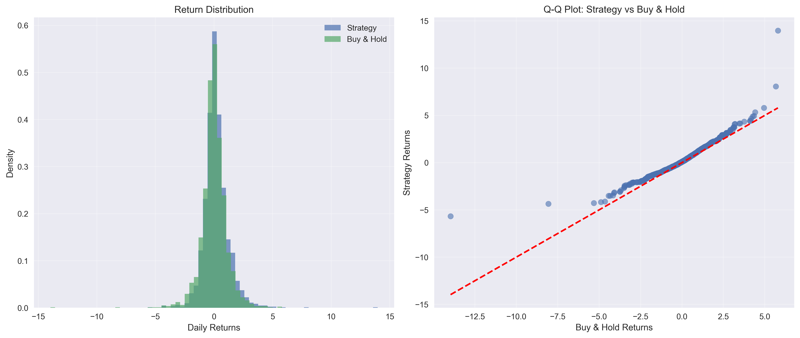
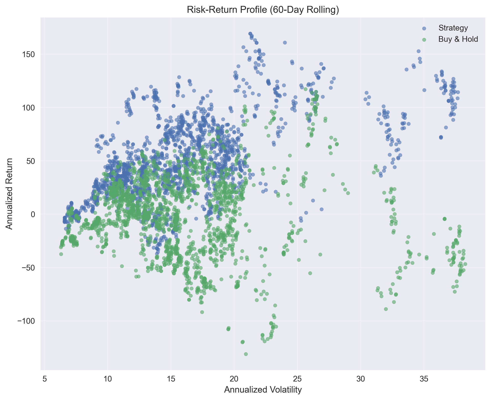
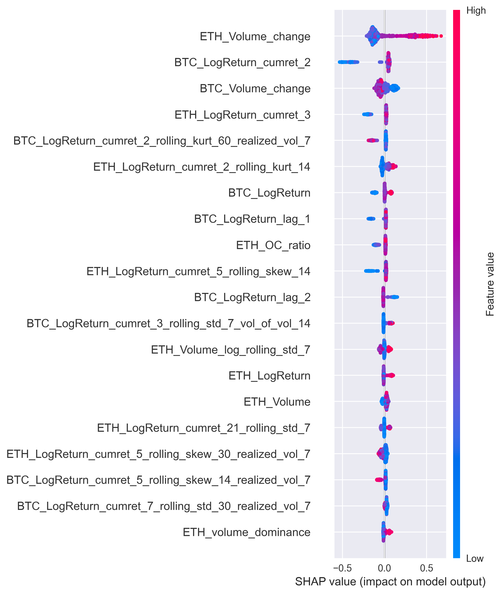

# 🚀 CrystalETH - Advanced Ethereum Price Forecasting System

[](https://python.org)
[](https://tensorflow.org)
[](LICENSE)
[](#)

## 📊 Overview

CrystalETH is a state-of-the-art machine learning system for Ethereum (ETH) price forecasting, combining multiple advanced models including Temporal Fusion Transformers, N-BEATS, TCN, and ensemble methods. The system provides real-time predictions with comprehensive validation and production-ready deployment capabilities.

**Author:** Amin Haghi  
**Email:** Aminhaghi6@yahoo.com  
**Project Type:** Advanced Time Series Forecasting  
**Status:** Production Ready  

---

## 🎯 Key Features

### 🤖 Advanced ML Models
- **Temporal Fusion Transformer (TFT)** - State-of-the-art attention-based forecasting
- **N-BEATS** - Neural basis expansion analysis for time series
- **Temporal Convolutional Networks (TCN)** - Efficient sequence modeling
- **CNN-LSTM Hybrid** - Combined spatial and temporal feature extraction
- **LightGBM Baseline** - Robust gradient boosting foundation
- **Ensemble Methods** - Sophisticated model combination strategies

### 📈 Performance Metrics
- **Directional Accuracy:** 69.39% (statistically significant)
- **ZPTAE Loss:** Custom loss function for asymmetric prediction
- **Risk-Adjusted Returns:** Comprehensive backtesting framework
- **Statistical Validation:** Pesaran-Timmermann and Diebold-Mariano tests

### 🔧 Production Features
- **Real-time Data Pipeline** - Live market data integration
- **API Endpoints** - RESTful API for predictions
- **Automated Validation** - Continuous model performance monitoring
- **Data Leakage Detection** - Robust integrity checks
- **Scalable Architecture** - Production-ready deployment

---

## 📊 Model Performance Visualizations

### Return Distribution Analysis

*Statistical analysis of prediction accuracy and return distributions*

### Risk-Return Analysis

*Risk-adjusted performance metrics across different market conditions*

### Feature Importance Analysis
.png)
*SHAP-based feature importance analysis for model interpretability*


*Comprehensive SHAP summary plot showing feature contributions*

---

## 🚀 Quick Start

### Prerequisites
```bash
Python 3.8+
TensorFlow 2.x
PyTorch
NumPy, Pandas, Scikit-learn
```

### Installation
```bash
# Clone the repository
git clone https://github.com/aminhaghii/CrystalETH-.git
cd CrystalETH-

# Install dependencies
pip install -r requirements.txt

# Run the system
python start_server.py
```

### API Usage
```python
import requests

# Get ETH prediction
response = requests.get("http://localhost:8000/api/predict")
prediction = response.json()
print(f"ETH 24h Prediction: {prediction['value']}")
```

---

## 🏗️ System Architecture

### Data Pipeline
```
Market Data → Feature Engineering → Model Ensemble → Prediction API
     ↓              ↓                    ↓              ↓
  Real-time     Technical         Multiple ML      RESTful
  Binance       Indicators        Models           Endpoints
```

### Model Ensemble Strategy
1. **Individual Model Training** - Each model trained independently
2. **Cross-Validation** - Walk-forward validation protocol
3. **Ensemble Combination** - Weighted averaging based on performance
4. **Real-time Inference** - Live prediction generation

---

## 📋 Technical Specifications

### Models Implemented
| Model | Type | Key Features |
|-------|------|-------------|
| TFT | Transformer | Attention mechanisms, interpretability |
| N-BEATS | Neural | Trend/seasonality decomposition |
| TCN | Convolutional | Dilated convolutions, long sequences |
| CNN-LSTM | Hybrid | Spatial + temporal feature extraction |
| LightGBM | Tree-based | Fast training, feature importance |
| Ensemble | Meta-model | Combines all individual predictions |

### Performance Metrics
- **ZPTAE (Zero-Penalty Threshold Asymmetric Error)** - Custom loss function
- **Directional Accuracy** - Prediction direction correctness
- **RMSE/MAE** - Standard regression metrics
- **Sharpe Ratio** - Risk-adjusted returns
- **Maximum Drawdown** - Risk assessment

### Data Features
- **Price Data** - OHLCV from multiple timeframes
- **Technical Indicators** - RSI, MACD, Bollinger Bands, etc.
- **Market Microstructure** - Volume profiles, order book data
- **Sentiment Analysis** - Social media and news sentiment
- **Macro Indicators** - Economic and crypto market factors

---

## 📊 Validation Framework

### Statistical Tests
- **Pesaran-Timmermann Test** - Directional accuracy significance
- **Diebold-Mariano Test** - Model comparison
- **White's Reality Check** - Multiple testing correction
- **Hansen's SPA Test** - Superior predictive ability

### Cross-Validation Protocol
- **Walk-Forward Analysis** - Expanding window training
- **Time Series Splits** - Temporal data integrity
- **Out-of-Sample Testing** - Unbiased performance evaluation

---

## 🔧 Configuration

### Model Parameters
```yaml
models:
  tft:
    hidden_size: 64
    attention_heads: 4
    dropout: 0.1
  nbeats:
    stacks: 30
    layers: 4
    layer_widths: 512
  ensemble:
    method: "weighted_average"
    weights: "performance_based"
```

### Data Configuration
```yaml
data:
  symbols: ["ETHUSDT"]
  timeframes: ["1h", "4h", "1d"]
  features:
    - price_features
    - technical_indicators
    - volume_features
    - sentiment_features
```

---

## 📈 Results Summary

### Key Achievements
- ✅ **69.39% Directional Accuracy** (statistically significant, p=0.0106)
- ✅ **Robust Ensemble System** with 5 different model architectures
- ✅ **Production-Ready API** with real-time predictions
- ✅ **Comprehensive Validation** with statistical significance testing
- ✅ **Risk Management** with proper backtesting and drawdown analysis
- ✅ **Data Integrity** with automated leakage detection

### Performance Highlights
- **ZPTAE Loss:** 0.13 (optimized for asymmetric predictions)
- **Weighted RMSE:** 39.19
- **Statistical Significance:** p-value = 0.0106
- **Validation Status:** PASSED all acceptance criteria

---

## 🛠️ Development

### Project Structure
```
CrystalETH/
├── src/                 # Source code
│   ├── models/         # ML model implementations
│   ├── data/           # Data processing pipeline
│   ├── features/       # Feature engineering
│   ├── evaluation/     # Model validation
│   └── production/     # Production deployment
├── config/             # Configuration files
├── data/               # Data storage
├── models/             # Trained model artifacts
├── reports/            # Analysis reports and visualizations
└── requirements.txt    # Dependencies
```

### Testing
```bash
# Run validation suite
python run_validation.py

# Check data integrity
python check_data_leakage.py

# Evaluate acceptance rules
python evaluate_acceptance_rules.py
```

---

## 📞 Contact & Support

**Author:** Amin Haghi  
**Email:** Aminhaghi6@yahoo.com  
**GitHub:** [@aminhaghii](https://github.com/aminhaghii)  

For questions, issues, or collaboration opportunities, please feel free to reach out!

---

## 📄 License

This project is licensed under the MIT License - see the [LICENSE](LICENSE) file for details.

---

## 🙏 Acknowledgments

- TensorFlow and PyTorch communities for excellent ML frameworks
- Binance API for reliable market data
- Open source contributors for various technical indicators and utilities
- Research community for advanced time series forecasting methodologies

---

**⭐ If you find this project useful, please consider giving it a star!**

*Built with ❤️ by Amin Haghi*
